# CHECKPOINT 5

## ¿Qué es un condicional?

Un condicional en Python es una manera de hacer que una aplicación sea dinámica, como si tomara decisiones. Ejecutará ciertas líneas de código solo si se cumplen la o las condiciones necesarias.

### CONDICIONAL BÁSICO

Usaremos **if** y **else**.

En el siguiente ejemplo indicamos que si la edad de una persona es menor que 15, aparecerá un texto concreto. En el ejemplo hemos usado f para poder incluir la variable aunque en este caso no la hemos incluido, así que podríamos no ponerlo.

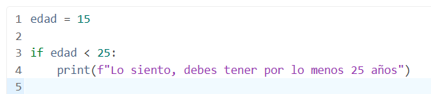

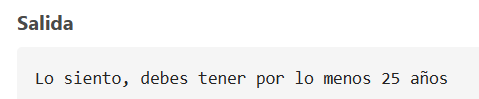

Si no se cumple la condición no pone nada porque no hemos configurado el “falso”.

Añadimos el “falso”:

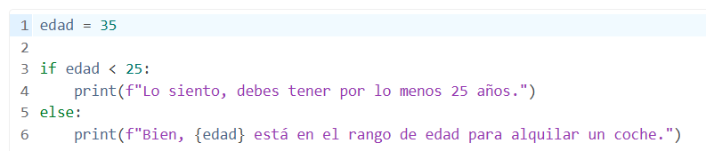

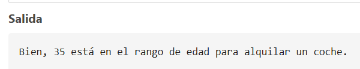

Si queremos añadir más condiciones usaremos **elif** (es como else if):

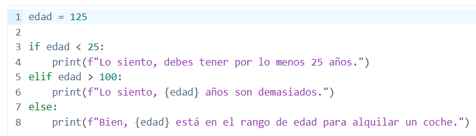

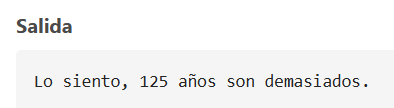

### OPERADOR TERNARIO

Se llama operador ternario a una manera más corta de escribir los condicionales. Es interesante si el código a meter ocupa una línea, si es más ya se está complicado más de la cuenta, y una de las buenas prácticas de Python es la sencillez. Si es más fácil con el código normal no deberíamos usar el operador ternario.

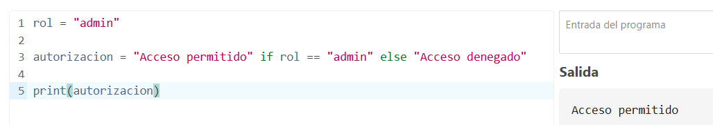

En este ejemplo vemos que con el operador ternario escribimos casi como hablamos. Este es un buen ejemplo porque es sencillo, no ocupa más de una línea.

Si lo hiciéramos de la forma habitual sería:

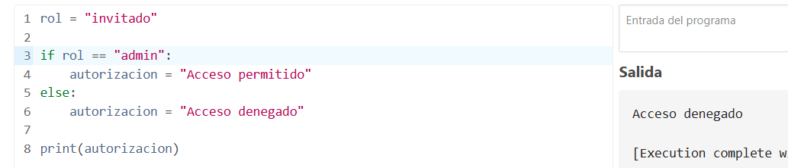

### LISTA COMPLETA DE OPERADORES CONDICIONALES EN PYTHON

- == Igual

- != Distinto

- \<\> Distinto (obsoleto)

- \>, \>=, \<, \<= Como en Excel: estos los usamos con números.

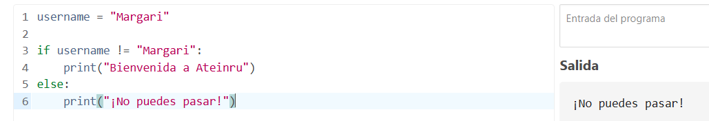

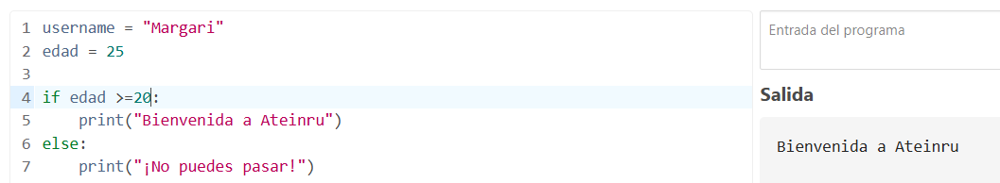

Podemos comparar también listas:

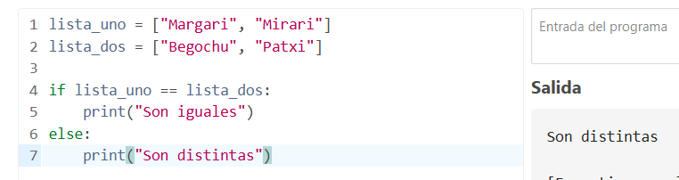

Lo podemos complicar un poco más:

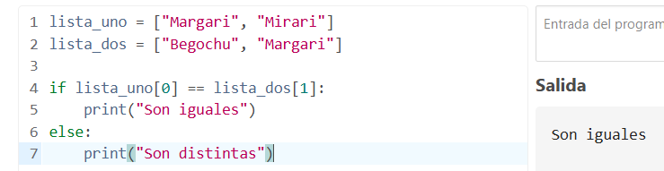

### CONDICIONALES COMPUESTOS (operadores and, AND NOT y or)

En ocasiones tenemos condiciones que no son únicas sino que se deben cumplir varias a la vez (**and**) o alguna de varias (**or**), o excluyendo alguna (**and not**).

Nos permite afinar mucho más en lo que queremos y lo que no.

En el siguiente ejemplo se deben cumplir dos condiciones a la vez, usamos **and**:

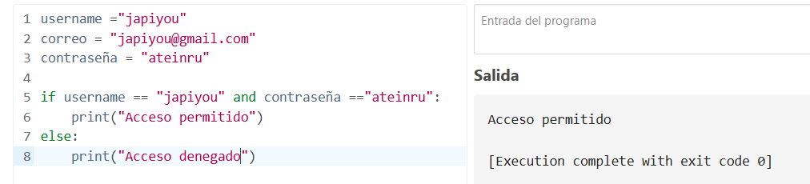

En el siguiente ejemplo se debe cumplir alguna de las dos condiciones, usamos **or**:

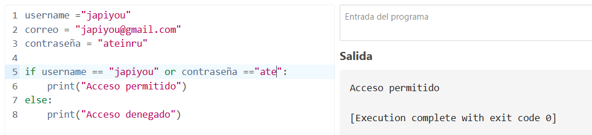

Podemos combinar and y or usando paréntesis:

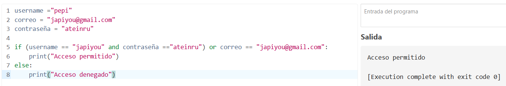

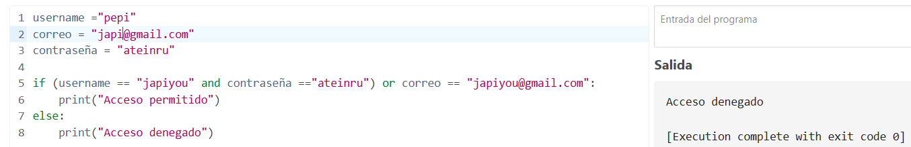

Otro ejemplo, esta vez con True o False, usamos **and not** para lo que queremos que no se cumpla.

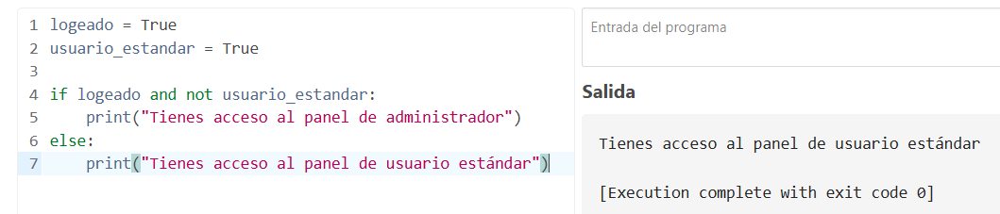

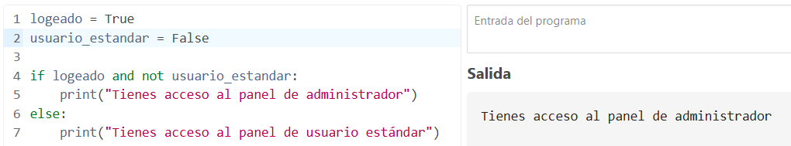

## ¿Cuáles son los diferentes tipos de bucles en Python? ¿Por qué son útiles?

Tenemos dos tipos de bucles o loops:

- **for…in:** con este tipo de bucles se itera el número de veces que haya elementos. No nos hace falta saber el número de items que hay en la colección, ya sea lista, tupla o diccionario porque simplemente cuando no haya más parará.

- **while:** es menos inteligente que el anterior. Deberemos decirle cuándo parar y si no lo hacemos se convertirá en un bucle infinito.

El 95% de las veces usaremos un bucle for…in porque es mejor, pero hay algunos casos en los que el loop while funciona mejor, los veremos más adelante.

### IMPLEMENTAR LOOPS EN LISTAS, TUPLES Y DICCIONARIOS

Veremos 3 tipos de estructuras clave para usar loops.

Es muy importante que después del for…in se use sangría, tenemos que comprobar que se pone sola y si no ponerla.

#### LOOP EN LISTAS

Usamos la siguiente estructura:

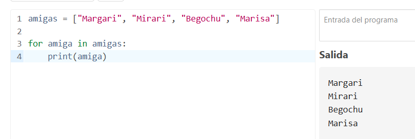

Explicación:

- amigas es el nombre de la variable, este tiene que ser este nombre.

- amiga, en realidad, podría ser cualquier nombre, pero la convención suele ser usar el singular de la variable. Se puede llamar variable de bloque o variable iteradora.

#### LOOP EN TUPLAS

Funcionará de la misma manera:

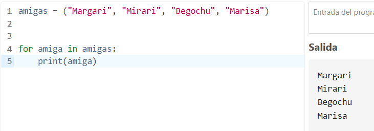

#### LOOP EN DICCIONARIOS

Si uso la misma estructura que antes no me da toda la información, porque los elementos del diccionario tienen claves:

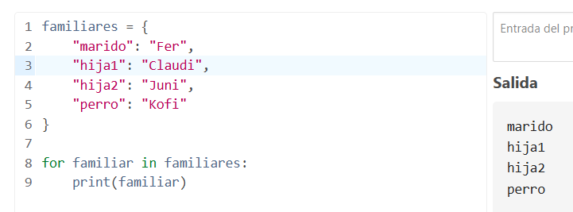

Entonces, en un diccionario tenemos que hacer lo siguiente:

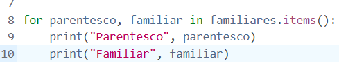

Ponemos las dos variables de bloque que hemos elegido, parentesco y familiar, y luego a la hora de imprimirlo lo añadimos como string para que aparezca también.

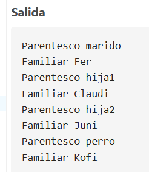

### LOOP A TRAVÉS DE LOS CARACTERES DE UN STRING

Podemos hacer un bucle a través de los caracteres de un string. Es súper sencillo, funciona como si el string fuese una colección.

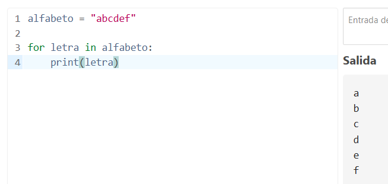

### LOOP EN RANGOS

Podemos crear el loop en el rango y vemos que parará uno antes del segundo parámetro, tenemos que tener en cuenta esto porque si queremos que llegue al 10 tendremos que darle como rango (1,11).

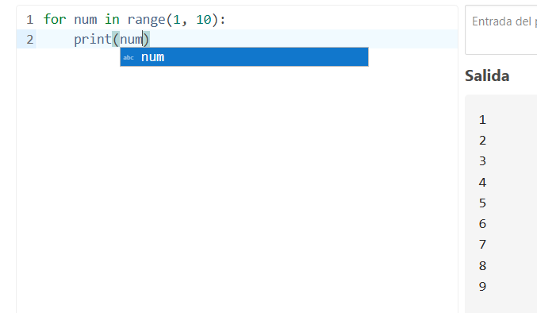

Si nos queremos saltar valores usaremos el tercer parámetro del rango, que indica el salto que da, en el ejemplo siguiente estamos indicando que vaya de dos en dos.

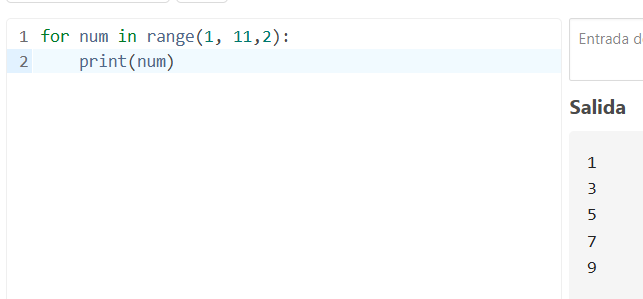

### ALTERAR EL COMPORTAMIENTO DEL LOOP EN ALGÚN MOMENTO

Quiero crear un bucle que cuando encuentre un valor cambie su comportamiento. Tenemos dos operadores lógicos de control de flujo diferentes:

- continue

- break

#### CONTINUE

Con continue, el loop sigue funcionando.

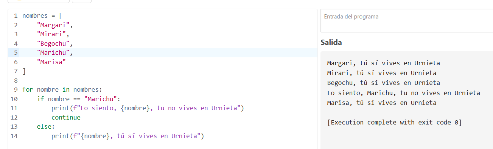

#### BREAK

Con break, lo que queremos es que si encuentra lo que busco pare porque no me importa el resto de cosas.

Veremos que el loop va funcionando hasta que encuentra lo que busca, y entonces para.

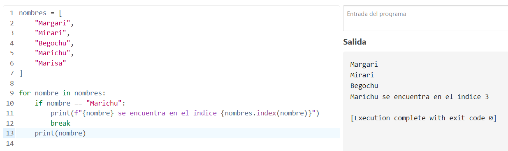

### LOOP WHILE

Habrá ocasiones en las que nos sea útil utilizar un bucle while.

Con el bucle for…in, hay un principio y un final. Con el bucle while, deberemos decirle cuándo parar, si no se convertirá en un bucle infinito. Para decirle que pare usaremos lo que se llama **valor centinela**, vamos a ver algunos ejemplos:

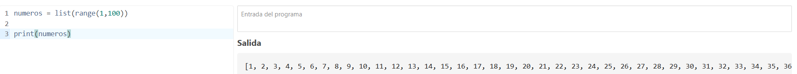

Usando for…in obtendríamos esto:

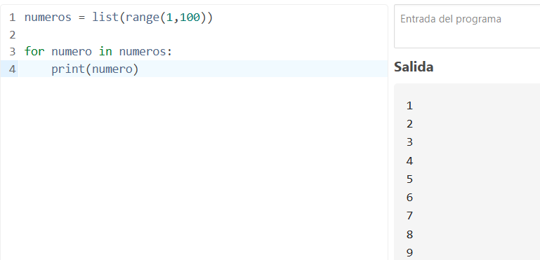

Con while es más complicado y mucho menos intuitivo:

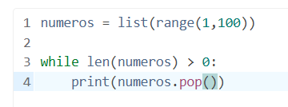 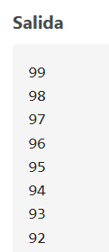

Lo que hacemos es decir, mientras que la longitud de la lista sea mayor que 0 (la lista al principio mide 99), imprime el último número y lo quitas (es lo que hace pop). Entonces ese pop es el valor centinela, que hace que al llegar a 0 pare. El resultado es en orden descendente.

Cuando no sabemos cuándo parar el bucle es cuando usaremos while. El ejemplo anterior no se haría con while, no tendría sentido.

## ¿Qué es una lista por comprensión en Python?

Una lista por comprensión (list comprehension) en Python es una forma corta y clara de crear listas automáticamente usando una sola línea de código. Se usan varios bucles en una sola línea de código.

A continuación, hacemos un ejemplo donde tenemos una lista de 1 a 10 y escribimos el código necesario para calcular el cubo de cada número de manera normal, sin usar lista de comprensión:

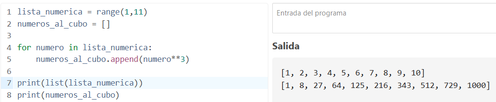

Usando una lista de comprensión será de la siguiente manera:

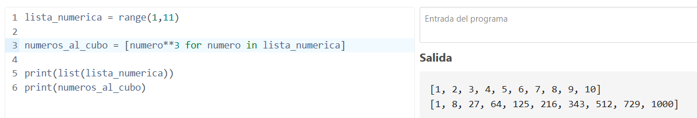

Al nombrar la variable números al cubo, indico que es una lista \[\] y directamente pongo dentro la acción que se deberá hacer para cada uno de los elementos. La variable de iteración nos la hemos inventado, podría valer cualquiera, por ejemplo aquí lo he sustituido por x:

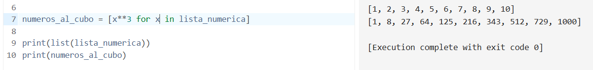

Hacemos un ejemplo más avanzado donde queremos agregar además una condición. Crearemos una lista que capture los números pares. Primero lo hacemos con todas las líneas de código:

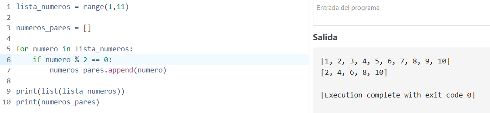

Ahora lo hacemos con lista de comprensión. Tendremos que poner la condición if al final de la línea.

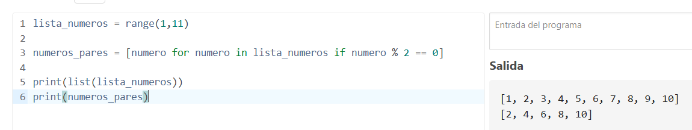

## ¿Qué es un argumento en Python?

Un argumento en Python es el valor que proporcionamos a una función en el momento de invocarla. La función está diseñada con sus parámetros y los argumentos son el dato que “rellenará” el lugar de dichos parámetros. Los argumentos se escriben dentro de los paréntesis de la función.

En el ejemplo siguiente, los argumentos serán Margari y Echeverría:

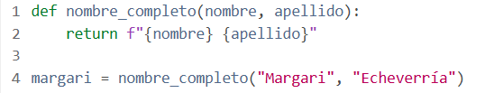

**Argumentos por defecto:** si la función necesita que pongamos un argumento, pero no siempre lo vamos a poner, es una buena práctica poner uno por defecto, como en el siguiente ejemplo:

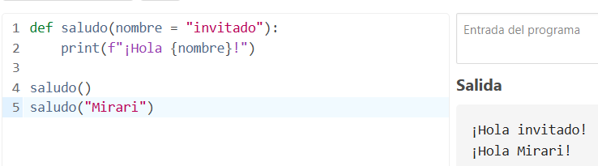

En caso de que invoquemos a la función saludo, pero no indiquemos ningún argumento dentro de los paréntesis, en el resultado aparecerá el argumento por defecto, en este caso invitado.

Existen varios tipos de argumentos:

### Argumentos determinados por su posición

Al definir una función esta tiene sus parámetros. Cuando queremos usar dicha función, pasamos los argumentos y ocuparán el orden correspondiente. El primer argumento ocupará el primer lugar en la función, el segundo ocupará el segundo lugar, y así sucesivamente.

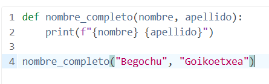

Esto está bien en funciones pequeñas, pero para funciones grandes puede ser complicado. Por ello tenemos el siguiente tipo de argumentos.

### ARGUMENTOS CON NOMBRE EN FUNCIONES DE PYTHON

La función se define igual que antes, pero a la hora de invocarla, especificamos en cada argumento cuál es su nombre. De esta manera es más fácil no equivocarse cuando tenemos funciones con varios parámetros.

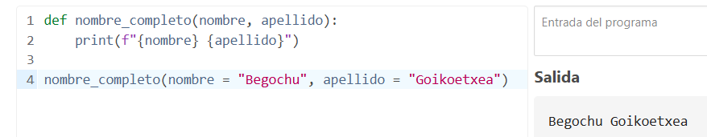

Si cambiamos de orden los argumentos, como estos tienen su nombre explícito, sale igual de bien:

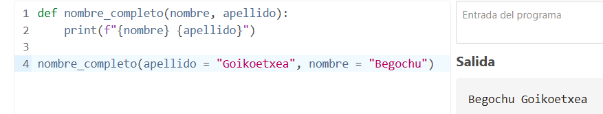

**Descompresión en colección de argumentos:** a veces tenemos una función en la que no sabemos cuántos argumentos habrá, en ese caso haremos lo siguiente:

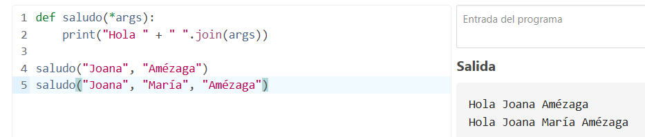

Al definir la función, en lugar de los argumentos ponemos \*args, esta es la convención normal en Python. El símbolo \* significa que hay de descomprimir los datos.

Después une “Hola “ con args. El espacio que pone aquí + “ “.join(args) es para separar cada elemento de la tupla, podría ser otra cosa, como un guion).

Luego veo que al llamar a la función pongo los argumentos que quiera y sale bien.

Si comento la línea de print y pongo otra para imprimir args, vemos que el resultado es una tupla con los argumentos:

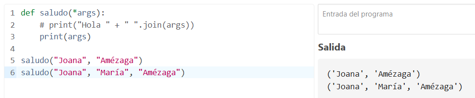

Podemos trabajar no solo con este tipo de argumentos de lista descomprimida sino poner además otro:

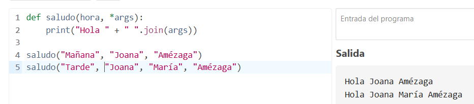

Aquí, el tiempo del día es un argumento normal y si lo pongo en mis argumentos, veo que sigue cogiendo mi nombre y apellidos como elementos de la tupla.

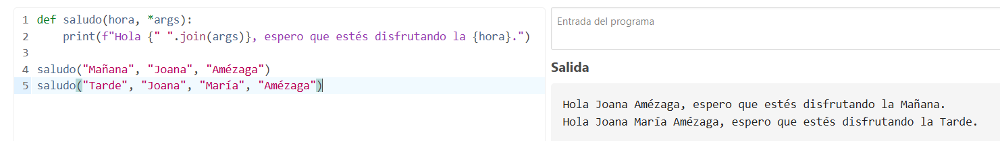

### ARGUMENTOS DE PALABRA CLAVE

Cuando se trabaja con argumentos de palabra clave, la diferencia con el desempacado de palabras clave es que entonces obteníamos una tupla y ahora un diccionario. Para usarlo hay que poner \*\*kwargs. kwargs es una convención que se suele usar en Python pero no es que sea obligatorio, sino solo una buena práctica.

En el ejemplo vemos que al llamar a la función y no pasar argumentos, la salida de imprimirlos es un diccionario vacío.

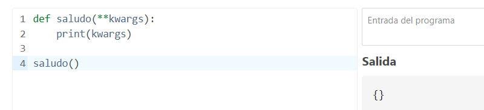

Si le ponemos argumentos y los imprimimos vemos que aparecen como un diccionario, primero la palabra clave y luego el valor:

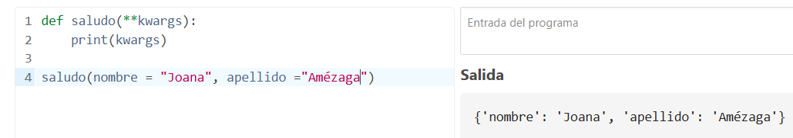

Le añadimos un condicional, de manera que si estamos logueados personalice el saludo y si no estamos logueados sea un saludo genérico:

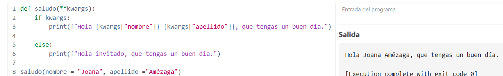

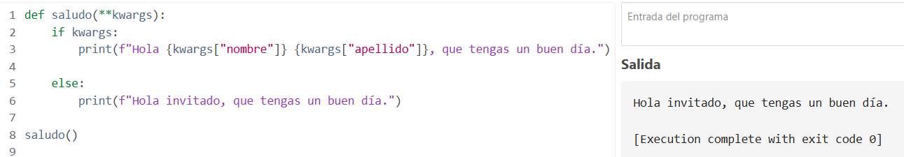

### COMBINAR TODOS LOS TIPOS DE ARGUMENTOS EN UNA FUNCIÓN DE PYTHON

Podemos usar varios tipos de argumentos a la vez, como en el siguiente ejemplo. Vamos a crear una función de saludo usando todos los tipos de argumento a la vez:

- Hora del día: argumento de posición.

- Args: argumentos desempacados, será el nombre y apellidos.

- Kwargs: argumentos de palabra clave: serán las tareas del día.

Si no hay tareas, es decir, argumentos de palabra clave, el mensaje que nos arroja es más corto:

## ¿Qué es una función Lambda en Python?

Es una función que permite empaquetar una minifunción. Se suele usar luego dentro de funciones. Su comportamiento es bastante parecido a una variable.

La función LAMBDA se define de la siguiente manera:

Es como cuando creamos una función pero más corto.

Ahora combinaremos la función LAMBDA con una función que crearemos:

Lambda nos permite empaquetar fácil y rápidamente una funcionalidad dentro de una variable, para luego poder usarla en otros procesos y otras partes del programa.

## ¿Qué es un paquete pip?

Un paquete pip en Python es una biblioteca o conjunto de código reutilizable que podemos instalar fácilmente en tu entorno de Python usando la herramienta llamada pip. Con pip importaremos paquetes de la tienda Pypi (también llamada Cheeseshop).

Con pip, que es el gestor de paquetes de Python, vamos a poder:

- Instalar librerías

- Actualizarlas

- Eliminarlas

Si hemos instalado Python desde la web oficial pip viene instalado. Si no lo tenemos lo instalaremos.

En la página <https://pip.pypa.io/en/stable/getting-started/> tenemos toda la información.

Descargamos y ejecutamos el archivo de esta url: <https://bootstrap.pypa.io/get-pip.py>

Una vez instalado comprobamos que funciona bien poniendo en el terminal pip --version

### EJEMPLO INSTALACIÓN BIBLIOTECA numpy

Vamos a instalar la biblioteca Numpy. Es un paquete que permite procesar números, registros y objetos. Es una de las bibliotecas más populares de la comunidad Python.

En la web <https://pypi.org/> buscamos numpy.

Vamos a instalarlo desde la terminal escribiendo: pip install numpy

En mi caso me ha dado un mensaje de alerta, porque el directorio donde se instala no está en el PATH, que es el grupo de carpetas donde Windows busca comandos. Hago un primer ejemplo usando el paquete numpy. Para usarlo lo importamos: import numpy as np (esto significa que lo importo y lo renombro como np para que sea más corto). Después se usan comandos del paquete numpy (en esta explicación no es relevante profundizar), que hacen mucho más fácil la tarea, que también podría realizarse sin numpy pero de una manera más complicada.
